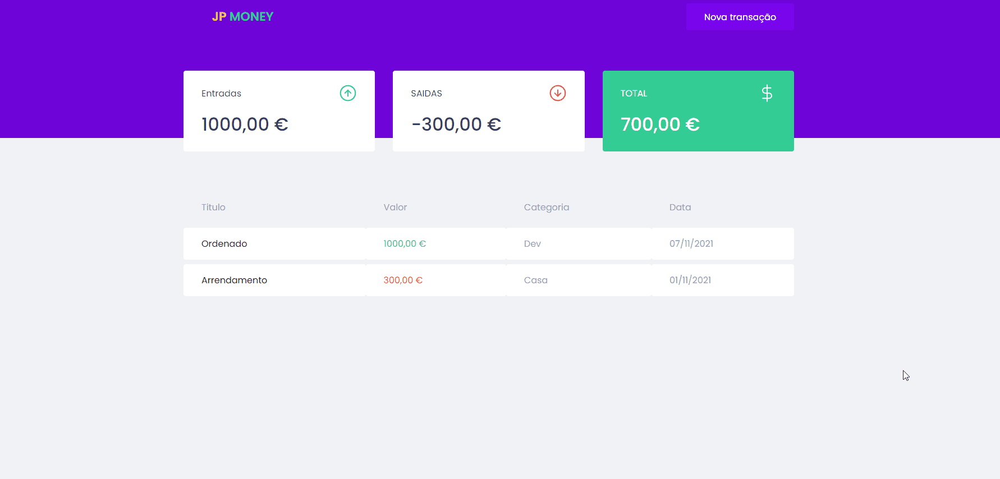

<p align="center">
  
</p>

<p align="center">
  

  

  
  <a href="https://github.com/DevJPVR/ShoppingCart/commits/master">
    
  </a>
    
   
   <a href="https://github.com/DevJPVR/jp-money/blob/main/LICENSE">


  <a href="#">
    
  </a>
  

 
</p>


<h1 align="center">
    
</h1>


<br>

## 🧪 Tecnologias

Esse projeto foi desenvolvido com as seguintes tecnologias:

- [React](https://reactjs.org)
- [MirageJS](https://miragejs.com/)
- [TypeScript](https://www.typescriptlang.org/)

## 🚀 Como executar

Clone o projeto e acesse a pasta do mesmo.

```bash
$ git clone https://github.com/DevJPVR/jp-money
```

Para iniciá-lo, siga os passos abaixo:
```bash
# Instalar as dependências
$ yarn
# Iniciar o projeto
$ yarn start
```
O app estará disponível no seu browser pelo endereço http://localhost:3000.


## 💻 Projeto

A aplicação tem como objetivo gerenciar os gastos mensais pessoais, onde é possivel cadastrar todas as entradas e saidas de dinheiro, atribuindo um titulo, uma categoria, o tipo da transação: entrada ou saida, e a data.
É possivel visualizar no Dashboard de forma pratica e dinamica todos os dados que são inseridos na tabela.

## 💻 Informações tecnicas

- Aplicação web desenvolvida em React com o Typescript
- Estilização feita com o styled-components
- Modal para cadastrar novas transações com o React-Modal
- Backend foi criada uma FakeApi com o MirageJS


## 📝 License

Esse projeto está sob a licença MIT. Veja o arquivo [LICENSE](https://github.com/DevJPVR/jp-money/blob/main/LICENSE) para mais detalhes.

---

Feito com 💜 by JoãoPedro
